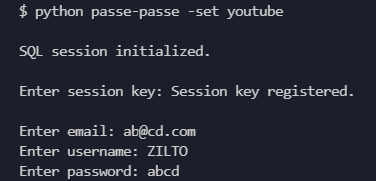
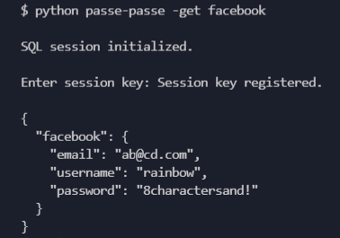
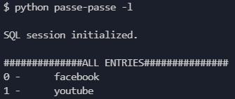

# Passe-passe
Passe-passe is a CLI password manager. Use the terminal to call "python passe-passe -set *website*" and you will receive a series of prompt to save your encryption secret and your website credentials. The credentials will be saved in a JSON object encrypted with AES-256-GCM, and stored in a portable SQLite database. The terminal inputs are cleared to avoid having your credentials logged anywhere.

## Commands
Call "python passe-passe -h" for details about all existing commands.

<pre><code> usage: passe-passe [-h] [-g GET] [-s SET] [-f] [-u UPDATE] [-del DELETE] [-dir DIRECTORY] [-l]

Store and manage credentials
optional arguments:
  -h, --help            show this help message and exit
  -g GET, -get GET, --get GET
                        Enter '-get website' to get credentials
  -s SET, -set SET, --set SET
                        Enter '-set website' to set credentials
  -f, -flag, --flag     Add '-f' or 'flag' to set command to make entry hidden to '-list' command
  -u UPDATE, -update UPDATE, --update UPDATE
                        Enter '-u website' to update credentials
  -del DELETE, -delete DELETE, --delete DELETE
                        Enter '-del website' to delete stored credentials
  -dir DIRECTORY, -directory DIRECTORY, --directory DIRECTORY
                        Enter '-dir directoryname' to set directory of databse
  -l, -list, --list     Display all websites stored in the database
</code></pre>

## CLI Screenshot
Calling -set *website* will generate 4 prompts: session key (encryption secret), email, username, and password

Calling -get *website* will ask you for the session key (encryption secret) used at encryption (when -set was called)

Calling -list *website* will print a list of stored entries that do not have the flag "hidden" set to True.

## Motivation
This project was built after one year of coding during some summer free time (2020). I wanted to build a tool I would use, and make it polished. This goal was a great source of motivation to structure a problem, and then finding a strategy to solve it through all the documentations.

## Things I've learned
This project introduced me to various concepts:
- cryptography (cryptodome, scrypt)
- relational databases (SQLalchemy, SQLite)
- terminal and os (argparse, subprocess, paths)